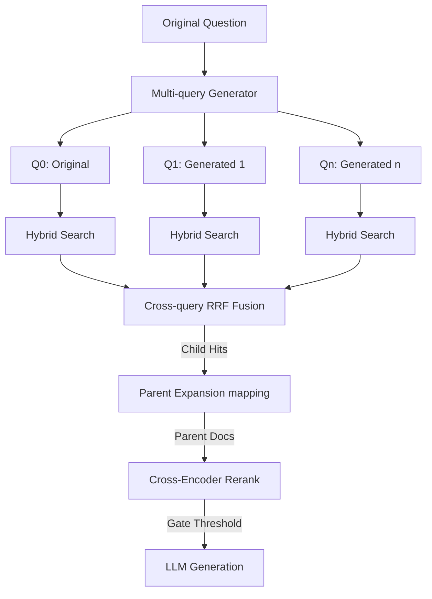

# RAG Foundation — Buổi 09: Multi-query & Parent-Child Retrieval

## 1. Mục tiêu và khác biệt so với Buổi 08
Buổi 09 nâng cấp từ retrieval phẳng (flat) sang mô hình Retrieval có cấu trúc phân cấp (Hierarchical Retrieval) kết hợp với mở rộng truy vấn (Query Fan-out).
- **Buổi 08**: Tìm kiếm trực tiếp Child chunks -> Rerank Child chunks -> LLM. (Dễ mất ngữ cảnh nếu chunk quá nhỏ).
- **Buổi 09**: Tìm kiếm Child chunks bằng nhiều biến thể câu hỏi (Multi-query) -> Fusion RRF -> Ánh xạ ngược lên Parent (Parent Expansion) -> Rerank Parent -> LLM. (Ngữ cảnh nguyên vẹn, bao quát hơn).

## 2. Sơ đồ Pipeline

## 3. Bốn Mode Comparison
Hệ thống hỗ trợ 4 chế độ Retrieval để tiện so sánh (Mode Routing):
1. **`single_flat`**: 1 Câu hỏi -> Tìm Child -> Rerank Child -> LLM (Giống Buổi 08).
2. **`multi_flat`**: Đa Câu hỏi -> Tìm Child -> RRF Child -> Rerank Child -> LLM.
3. **`single_parent`**: 1 Câu hỏi -> Tìm Child -> RRF Child -> Map Parent -> Rerank Parent -> LLM.
4. **`multi_parent`**: Đa Câu hỏi -> Tìm Child -> RRF Child -> Map Parent -> Rerank Parent -> LLM (Chế độ đầy đủ).

## 4. Cấu trúc Project và Setup `.env`
Các tham số cấu hình runtime lưu tại `.env`:
- `MULTI_QUERY_COUNT`: Số lượng query biến thể (Tối đa 5).
- `PER_QUERY_CANDIDATES`: Số child lấy cho mỗi query.
- `PARENT_CANDIDATES`: Số parent tối đa đem đi Rerank.
- `FINAL_PARENT_TOP_K`: Số parent tối đa đưa vào ngữ cảnh.
- `RERANK_MIN_SCORE`: Ngưỡng điểm chuẩn hoá (0-1) để chấp nhận Evidence.

## 5. Build Hierarchy và Warning
Hệ thống duy trì một Store trung gian (`storage/hierarchy`). 
- Build bằng lệnh `python hierarchical_rag.py build-hierarchy`.
- Lệnh sẽ nạp từ dữ liệu Buổi 05, nhận diện tự động cấu trúc Điều/Khoản.
- **Ambiguous Warning**: Nếu một Child bị ngắt trang lơ lửng không tìm thấy Parent ID rõ ràng, nó sẽ bị gắn cờ `ambiguous` (cảnh báo nhập nhằng) nhưng hệ thống không tự động loại bỏ.

## 6. Query Expansion Contract và API Budget
- Bắt buộc phải có `Q0` là câu hỏi gốc.
- Các `Qn` (Generated) được sinh bằng LLM.
- **Budget**: Toàn bộ Pipeline chỉ cho phép tối đa 2 lần gọi API Generation: 1 cho Expansion, 1 cho Answer.

## 7. Công thức RRF
- **Inner RRF**: (Bên trong Hybrid Search của Buổi 09) = `(1 / (60 + BM25)) + (1 / (60 + Semantic))`.
- **Cross-query RRF**: Hợp nhất các query.
  `Score(child) = Sum( weight(q) / (60 + rank_q(child)) )`
- **Parent Aggregation**:
  `Score(parent) = Sum( weight(child) / (60 + rank(child)) )` (Chỉ lấy tối đa `PARENT_SCORE_CHILD_LIMIT` best children).

## 8. Child Retrieval, Parent Return, Rerank
- Chú ý: **Không Rerank bằng Generated Query**. Cặp input cho mô hình Rerank luôn là `(Original Question, Parent Text)`.
- Các Child hits đóng vai trò hoa tiêu (Anchor), sau đó Text được lấy từ Parent để LLM đọc.

## 9. Lệnh CLI
- `build-hierarchy`: Build cấu trúc.
- `hierarchy-audit` / `hierarchy-status`: Kiểm tra toàn vẹn.
- `expand-query`: Chạy thử Multi-query Generator.
- `multi-child`: Chạy thử Hybrid + RRF Child.
- `parent-retrieve`: Trả về Parent Hits.
- `query`: Chạy Full Pipeline sinh câu trả lời.
- `compare`: So sánh Rank/Latency 4 mode (không gọi LLM).
- `evaluate`: Chạy bộ đánh giá (Recall, MRR, nDCG).
- `streamlit run app.py`: Giao diện Web.

## 10. Giới hạn K và Context Budget
- `char_count` được đo lường để đảm bảo không vượt quá token LLM. Nếu Parent vượt quá, hệ thống báo `oversized` và có thể drop Parent thứ 2 trở đi.

## 11. Evaluation Metrics
- Metrics chính: `Child Recall@K`, `Parent Recall@K`, `MRR@K`, `nDCG@K`.
- Nếu file `eval/questions.json` có cờ `needs_human_review = true`, số liệu so sánh không được tự động công nhận là kết quả tuyệt đối (Vì nhãn không phải con người duyệt 100%).

## 12. Troubleshooting
- `hierarchy_not_ready`: Chạy `build-hierarchy`.
- `query_generation_unavailable` hoặc `reranker_unavailable`: Kiểm tra mạng, API Key hoặc Model Path.
- `insufficient_evidence`: Nới lỏng `RERANK_MIN_SCORE`.

## 13. Tuyên bố từ chối trách nhiệm
Ứng dụng RAG này **KHÔNG PHẢI LÀ TƯ VẤN PHÁP LÝ**. Mọi câu trả lời do AI sinh ra cần được đối chiếu lại với văn bản quy phạm pháp luật gốc trước khi áp dụng vào thực tế.
